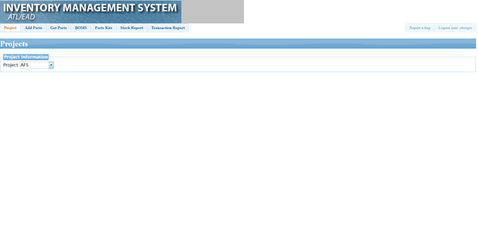
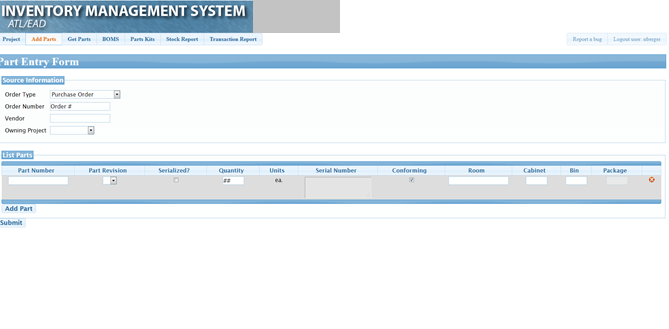
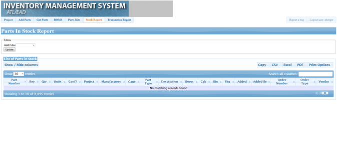
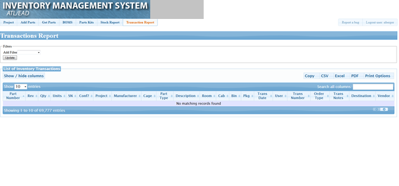

# inventory-mgmt - Project 3

A refresh of my department's Inventory Management System

## Value Add Proposal

My department at my current job uses a web-based inventory management system to track components and assemblies during the research and manufacturing process. The current system was developed in 2010 and is in desperate need of an update, from many of the user's perspectives. This application serves to refresh and refactor the technology and performance of the current system.

## Tech Stack

- MERN Stack

  - MongoDB
    - Mongoose
  - Express.js
  - React.js
  - Node.js

- HTML5
- CSS3
- Bootstrap
- Javascript
- Moment.js
- Temporarily deployed with Heroku
- Yarn
- Moqups
- Jest
- Enzyme

## Project Organization

This project is managed with GIT, using the GitHub Flow method and GitHub Projects.

Officially, I am the only person on the project team but I am hardly an island. I received guidance of all types from my bootcamp intructional team, current inventory mangement users, and the developers that support the current system.

## MVP

PHASE ONE

- Create database structure
- Setup Wireframe layout

PHASE TWO

- Implement ability to add part definitions
- Implement ability to add manufacturer definitions
- Implement ability to add vendor definitions
- Implement ability to add parts
- Implement ability to display parts
- Implement ability to search parts

PHASE THREE

- Create functionality to perform transaction reports
- Create ability for admin users to edit part definitions

## Current Application Screenshots

## Wireframe

## App Flow

This is the basic intended flow off the app.

## Demo

_Inventory-mgmt_ is deployed to Heroku. Please check it out [here](https://inventory-mgmt-ead.herokuapp.com/).

- What is the direct link to the project? Quick start options:
  - The code is hosted here: [inventory-mgmt](https://nicolejeanne.github.io/inventory-mgmt/).
